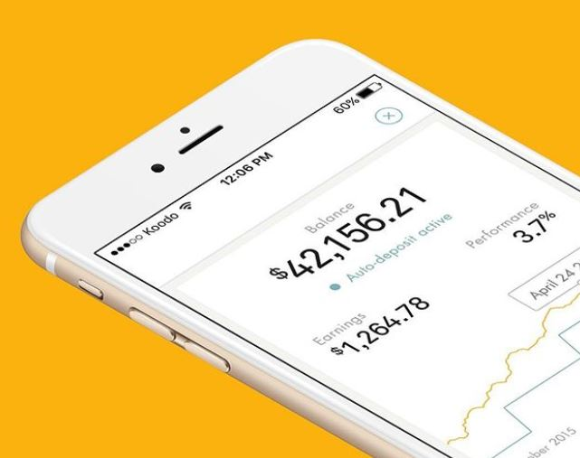

# The Democratization of Wealth Management
### Chrishan de Almeida
### February 13, 2021

---
## Overview and Origin

###### Name of company: Wealthsimple

###### Date of incorporation: September 2014

###### Founder: Michael Katchen

Wealthsimple had very humble beginnings.  Its inception, formation, and evolution was a process, having taken place over many years.  It started with its founder, Michael Katchen, taking an interest in investing at an early age, winning his first stock contest at the age of 12.  Katchen carried his passion for investing with him throughout his life and, as he got older, became the go-to guy amongst his friends for investment advice.

It was in his early twenties that Katchen and his fellow co-workers found themselves with a substantial windfall after the Silicon Valley-based startup that they were working for had been bought over.  Katchen developed a spreadsheet with tips to help his colleagues set up investment portfolios to make the most of their new-found fortunes.  His spreadsheet gained considerable popularity amongst his co-workers, inspiring Katchen to start his own wealth management firm to provide financial empowerment to as many people as possible.

In 2014, Katchen returned to his native Toronto to launch Wealthsimple.  The company was able to initially raise CAD 1.9 million from investors in May of that year, followed by an additional CAD 30 milion over the course of 2015 and 2016 from Power Financial Corporation.

---
## Business Activities:

Long has traditional wealth management been a service enjoyed solely by the wealthy and not the common masses.  This was a problem and an opportunity that Katchen saw.

Wealthsimple believes that access to financial freedom is a fundamental human right, and the company's mission is to democratize wealth management and bring it to the masses by providing simple and sophisticated products and advice that are accessible and affordable using technology.

Wealthsimple's intended customers are average people and retail investors of varying backgrounds who wish to participate more fully in the financial market through Wealthsimple's accessible investment platforms and affordable wealth management services.  That being said, the company does have a particular marketing focus on the new generation of wealth; Millenials.

Millenials are now the largest generation of Canadians, making up 27% of the total population.  Though still relatively early in their careers, Millenials have a higher real median after-tax household income and net worth than previous generations at the same age.  Having had the internet around for most of their lives, millenials take advantage of their tech-savviness and seek out financial knowledge and advice online moreso than previous generations.  This, in combination with having higher net worths, has created a large market size of Millenials with investible assets at their disposal, looking for a more simple, modern way of growing their wealth.

Being a smaller firm, Wealthsimple is able to avoid the kind of inefficient beaurocracy that exists in larger financial institutions.  This allows Wealthsimple to develop and launch innovative products much faster than their larger competitors.  Also, being a firm that was founded by Millenials, Wealthsimple has a better pulse on the values and culture of this new, emerging class of Millenial wealth.  This gives the firm an advantage over traditional, archaic financial instutitions when it comes to attracting and capturing market share of this demographic.  

Also, from a business standpoint, Wealthsimple's Silicon Valley startup influence and informal, inclusive approach to work culture stands in stark contrast to the culture within traditional financial instutions.  This makes Wealthsimple much more attractive as a place of employment to younger, top talent, thus setting the firm up for stronger long term success in this rapidly changing industry.

Though Wealthsimple is one of the first mainstream Canadian FinTechs, they are still a small player in the world of finance in Canada.  They know that their "kill shot" in this proverbial David and Goliath standoff lies in their fresh take on financial services as well as their alignment with the wants and ideals of the Millenial generation.

One technology that Wealthsimple is using to bring wealth management services to the masses is  robo-advisory.  A robo-advisor is a service that uses highly specialized software to do the job of wealth managers.  It is a digital platform that allows for money to be invested on auto-pilot using an algorithm.  First, the customer answers a few questions about themselves.  Then the robo-advisor will recommend a specific portfolio to suit the customer's goals and appetite for risk.

---
## Landscape:

The domain in which Wealthsimple exists is Wealth Management.  Some of the major trends and innovations in this domain over the last 5-10 years has been the introduction robo-advising, lower fees, online platforms, and increased customer autonomy.  Other Canadian wealth management FinTechs that use robo-advisory and provide innovative financial services are Nestwealth, Wealthbar, Justwealth, ModernAdvisor, Questrade, Betterment, as well as larger financial institutions such as RBC, Scotiabank, etc.

---
## Results

Putting more people on the path to financial freedom by removing barriers to accumulating and managing wealth has stripped away some of the market share from traditional wealth management institutions and reallocated it to Wealthsimple.  They are a true disrupter in Canadian finance, and will continue to give traditional financial institutions a run for their money at an increasingly rapid rate.

The world of wealth management/robo-advisory FinTechs is still very new.  It is akin to the Wild West, where there is a lot up for grabs to those who can take it first.  There is a gap between the emerging demand for affordable wealth management/robo-advisory and those who can provide it.  This vaccuum is being quickly filled with many different players trying to estbalish themselves in the space.  Therefore, rapidly growing a customer base and taking up as much market share as possible as soon as possible is one of the most important core metrics of success for companies in this domain.  Based on this, Wealthsimple can be considered a massive success.  Their customer base has rapidly grown from around 1,000 clients in 2015 to 1.5 million clients in 2021, making them the market leader in Canada for this domain.

---
## Recommendations

I believe Wealthsimple would greatly benefit from offering lines of credit to their wealth management clients.  Lines of credit tend to be "sticky" financial products, meaning that they help bring in and retain assets under management and clients.  

If Wealthsimple were to offer easy, hassle-free security-backed lines of credit, they could attract new clients who will custody their fresh stock portfolios with Wealthsimple as collateral for the lines of credit.  In addition to earning revenue from these credit products, Wealthsimple will also earn increased revenue from management fees on the newly custodied portfolios.

In that same line of thinking, since Wealthsimple earns a considerable amount of their revenue from management fees, it is in their best interest to avoid having their clients liquidate their portfolios when the funds are needed.  That's where lines of credit help retain the assets under management.  Rather than have a client sell their portfolio, Wealthsimple can offer them a line of credit as a means of liquidity to meet the client's financial needs instead.

In order to offer quick, hassle-free lines of credit that are more attractive than the credit products offered by other, larger financial institutions, Wealthsimple will need to adopt a streamlined risk rating method in order to qualify their clients for lines of credit much faster than the competition can.  Wealthsimple will have to get clever in how this will be done.  For example, the risk rating can be a combination of a FICO score plus other datapoints that Wealthsimple believe are reliable indicators of risk and can be easily acquired and processed by a risk-rating algorithm.  Such datapoints can be "outside the box" metrics gathered from social media data respositories, etc.  Doing so may allow Wealthsimple to create a more holistic, accurate risk model that they can use to assess risk for more customers in a shorter amount of time than the competition.

Integrating the aforementioned credit underwriting technology with Wealthsimple's already easy-to-use user interface will make these credit products very popular and profitble in my opinion.  The faster and easier Wealthsimple can grant these lines of credit, the more portfolios they will receive as collateral, and the higher their management fee revenue will be for them.  In addition, they will also be establishing a new interest revenue stream on the lines of credit.

---
## Bibliography
* (https://financialpost.com/entrepreneur/fp-startups/wealthsimple-aims-to-turn-financial-services-industry-on-its-head-with-new-low-coast-approach-to-investing)

* (https://www.wealthsimple.com/en-ca/about/who-we-are) 

* (https://www.canadianbusiness.com/innovation/change-agent/michael-katchen-wealthsimple/)

* (https://financialpost.com/personal-finance/young-money/millennial-focused-wealthsimple-takes-over-boomer-robo-adviser-shareowner?r)

* (https://www.wealthsimple.com/en-ca/about/work-with-us/)

* (https://www150.statcan.gc.ca/n1/pub/11-626-x/11-626-x2019006-eng.htm)

* (https://www.wealthsimple.com/en-ca/learn/what-is-robo-advisor)